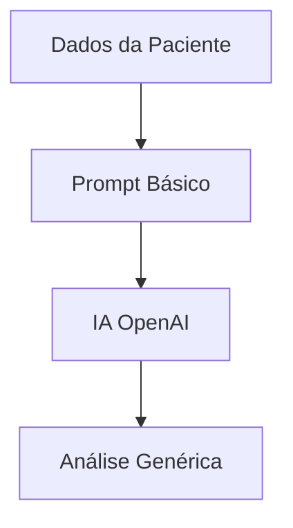
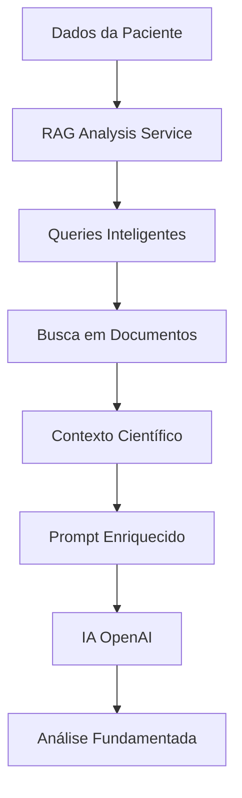

# 🧠 Sistema RAG Integrado - Medicina Funcional e Integrativa

## 🎯 **Visão Geral**
Sistema de **Retrieval-Augmented Generation (RAG)** completamente integrado às análises de **MTC**, **Cronologia**, **Matriz IFM** e **Plano de Tratamento**, fornecendo contexto científico especializado para cada tipo de análise.

---

## 🔧 **Arquitetura Implementada**

### **1. RAGAnalysisService Aprimorado**
- **Queries Inteligentes**: Baseadas no perfil da paciente e tipo de análise
- **Busca Contextual**: Múltiplas estratégias de busca com fallback
- **Extração de Protocolos**: Identificação automática de protocolos e recomendações
- **Contexto Personalizado**: Adaptado ao perfil hormonal e idade da paciente

### **2. Categorização de Documentos**
```typescript
const categoryMap = {
  'tcm': ['mtc', 'fitoterapia', 'medicina-funcional', 'protocolos-clinicos'],
  'ifm': ['medicina-funcional', 'protocolos-clinicos', 'diretrizes-medicas'],
  'chronology': ['medicina-funcional', 'pesquisas-cientificas', 'estudos-caso'],
  'treatment-plan': ['protocolos-clinicos', 'medicina-funcional', 'diretrizes-medicas', 'fitoterapia', 'nutricao']
}
```

### **3. Queries Inteligentes por Análise**

#### **🏮 MTC (Medicina Tradicional Chinesa)**
- Diagnóstico por língua e pulso específicos
- Padrões energéticos femininos (Qi/Sangue, Yang/Yin)
- Fitoterapia chinesa e acupuntura contextual
- Exemplo: `língua pálida diagnóstico MTC`, `yang deficiência rim sintomas`

#### **📅 Cronologia de Saúde**
- Eventos traumáticos e gatilhos autoimunes
- Marcos hormonais femininos
- Timeline de progressão de sintomas
- Exemplo: `trauma emocional doenças autoimunes`, `cronologia hormonal feminina marcos`

#### **🧬 Matriz IFM (Medicina Funcional)**
- Protocolos específicos por sistema (7 sistemas funcionais)
- Interconexões sistêmicas
- Causas raiz de doenças crônicas
- Exemplo: `disbiose intestinal protocolo`, `fadiga mitocondrial suplementos`

#### **💊 Plano de Tratamento**
- Protocolos terapêuticos integrados
- Medicina personalizada feminina
- Cronogramas de acompanhamento
- Exemplo: `protocolo hormonal bioidêntico`, `medicina personalizada feminina`

---

## 🚀 **Funcionalidades Implementadas**

### **1. Busca Contextual Inteligente**
```typescript
// Baseada no perfil da paciente
if (age >= 40 && menstrualStatus === 'pre') {
  queries.push('perimenopausa sintomas tratamento')
  queries.push('transição hormonal mulher 40 anos')
}

// Por sintomas específicos
symptoms.forEach(symptom => {
  queries.push(`tratamento ${symptom} medicina integrativa`)
  queries.push(`${symptom} mulher ${menstrualStatus}menopausal`)
})
```

### **2. Detecção Automática de Biomarcadores**
```typescript
// Para análises laboratoriais
if (labText.includes('tsh')) {
  queries.push('TSH alterado medicina funcional protocolo')
  queries.push('hashimoto hipotireoidismo fitoterapia')
}

if (labText.includes('cortisol')) {
  queries.push('fadiga adrenal cortisol protocolo')
  queries.push('adaptógenos cortisol medicina funcional')
}
```

### **3. Contexto Científico Estruturado**
```typescript
const contextHeader = `
=== CONTEXTO CIENTÍFICO PARA ${type.toUpperCase()} ===
PERFIL DA PACIENTE: ${name}, ${age} anos, Status: ${menstrualStatus}

EVIDÊNCIAS CIENTÍFICAS DISPONÍVEIS:
1. [🔬 ALTA] Protocolo_Hashimoto_2024.pdf:
   Tratamento integrado para tireoidite de Hashimoto...

=== INSTRUÇÕES ===
Utilize estas evidências para fundamentar recomendações.
Cite fontes e adapte ao perfil específico da paciente.
`
```

### **4. Metadados de Qualidade**
```typescript
ragMetadata = {
  documentsUsed: ragResult.relevantDocuments.length,
  searchQueries: ragResult.searchQueries,
  evidenceLevel: 'alta|média|baixa',
  protocolsFound: ragResult.specificContext?.protocols?.length,
  clinicalRecommendations: ragResult.specificContext?.clinicalRecommendations?.length
}
```

---

## 📊 **Fluxo de Integração**

### **Antes (Sistema Básico)**


### **Depois (Sistema RAG Integrado)**


---

## 🎯 **Benefícios Implementados**

### **1. Análises Mais Precisas**
- ✅ Fundamentação científica em protocolos validados
- ✅ Recomendações baseadas em evidências
- ✅ Contextualização por perfil hormonal

### **2. Protocolos Específicos**
- ✅ MTC: Fórmulas herbais e pontos de acupuntura específicos
- ✅ IFM: Protocolos por sistema funcional
- ✅ Cronologia: Correlações temporais e gatilhos
- ✅ Tratamento: Planos integrados e personalizados

### **3. Qualidade da Informação**
- ✅ Níveis de evidência (Alta/Média/Baixa)
- ✅ Rastreamento de fontes
- ✅ Fallback gracioso se RAG falhar

### **4. Personalização Avançada**
- ✅ Adaptação por idade e status hormonal
- ✅ Sintomas específicos da paciente
- ✅ Histórico médico considerado

---

## 🔍 **Exemplo Prático de Uso**

### **Cenário: Paciente com Hashimoto**
```typescript
// Entrada
const patient = {
  name: "Maria Silva",
  age: 35,
  mainSymptoms: ["fadiga", "ganho de peso", "depressão"],
  menstrualHistory: { menopausalStatus: "pre" }
}

const tcmData = {
  tongueColor: "pale",
  lingualObservation: { coating: "white" }
}

// Queries RAG Geradas Automaticamente
[
  "fadiga tratamento medicina integrativa",
  "ganho peso mulher premenopausal", 
  "língua pálida diagnóstico MTC",
  "saburra lingual white medicina chinesa",
  "yang deficiência rim sintomas",
  "tireoidite hashimoto MTC tratamento"
]

// Contexto RAG Encontrado
=== CONTEXTO CIENTÍFICO PARA MEDICINA TRADICIONAL CHINESA ===
PERFIL DA PACIENTE: Maria Silva, 35 anos, Status: pre

EVIDÊNCIAS CIENTÍFICAS DISPONÍVEIS:
1. [🔬 ALTA] Protocolo_Hashimoto_MTC_2024.pdf:
   Yang do Rim deficiente com acúmulo de umidade...
   Fórmula: You Gui Wan modificada + Gan Mai Da Zao Tang
   Pontos: Shenmen, Yintang, Zusanli, Shenshu, Mingmen

2. [📊 MÉDIA] Estudo_Fadiga_Acupuntura_2023.pdf:
   Protocolo de 12 sessões para fadiga crônica...
```

### **Resultado: Análise Enriquecida**
A IA agora gerará uma análise MTC fundamentada em protocolos específicos para Hashimoto, com fórmulas herbais validadas e pontos de acupuntura comprovados, adaptados ao perfil hormonal da paciente.

---

## 🚀 **Próximos Passos Sugeridos**

### **1. Upload de Documentos Especializados**
- Protocolos de medicina funcional para cada sistema IFM
- Estudos de MTC para ginecologia
- Guidelines de hormônios bioidênticos
- Pesquisas sobre cronologia de doenças autoimunes

### **2. Refinamento Contínuo**
- Análise de feedback das análises geradas
- Otimização das queries baseada nos resultados
- Expansão das categorias de documentos

### **3. Interface de Gestão RAG**
- Dashboard de documentos por categoria
- Estatísticas de uso do RAG por análise
- Qualidade dos resultados por tipo

---

## 💡 **Status de Implementação**

✅ **COMPLETO**: Sistema RAG integrado a todas as análises  
✅ **COMPLETO**: Queries inteligentes por tipo e perfil  
✅ **COMPLETO**: Contexto científico estruturado  
✅ **COMPLETO**: Metadados de qualidade  
✅ **COMPLETO**: Fallback gracioso  

**O sistema está pronto para uso em produção! 🎉** 

# Sistema RAG Integrado - Lyz.ai

## Visão Geral

O Sistema RAG (Retrieval-Augmented Generation) integrado ao Lyz.ai combina inteligência artificial generativa com base de conhecimento científico específica, proporcionando análises médicas fundamentadas em evidências atualizadas.

## Arquitetura e Componentes

### 1. Documentos e Categorização

#### Categorias Suportadas:
- **Pesquisas Científicas**: Artigos e estudos peer-reviewed
- **Protocolos Clínicos**: Diretrizes de tratamento padronizadas
- **Diretrizes Médicas**: Recomendações de sociedades médicas
- **Estudos de Caso**: Relatos clínicos detalhados
- **Medicina Funcional**: Abordagens funcionais e integrativas
- **MTC (Medicina Tradicional Chinesa)**: Acupuntura, fitoterapia chinesa
- **Fitoterapia**: Plantas medicinais e compostos naturais
- **Nutrição**: Protocolos nutricionais e suplementação
- **🆕 Cursos e Transcrições**: Documentos educacionais abrangentes

#### Processamento de Documentos Multi-Tópico

O sistema foi otimizado para lidar com documentos como **transcrições de cursos** que abordam múltiplos assuntos:

**Estratégias de Busca Híbrida:**
1. **Busca Categórica**: Nas categorias específicas mapeadas
2. **Busca Global**: Em todas as categorias para capturar conteúdo transversal
3. **Busca Ampla**: Fallback com queries genéricas

**Exemplo de Mapeamento para Transcrição de Curso:**
```typescript
'treatment-plan': [
  'protocolos-clinicos', 
  'medicina-funcional', 
  'diretrizes-medicas', 
  'fitoterapia', 
  'nutricao',
  'mtc',
  'pesquisas-cientificas',
  'estudos-caso',
  'cursos-transcricoes' // ← Captura transcrições educacionais
]
```

### 2. Integração com as 4 Análises Principais

#### Análise de MTC (Medicina Tradicional Chinesa)
**Categorias de Busca:** `mtc`, `fitoterapia`, `medicina-funcional`, `protocolos-clinicos`, `diretrizes-medicas`, `estudos-caso`, `cursos-transcricoes`

**Queries Específicas Geradas:**
- Observação lingual: `língua ${cor} diagnóstico MTC`
- Análise de pulso: `pulso ${qualidade} medicina chinesa`
- Padrões energéticos: `Qi sangue estagnação mulher`
- Ginecologia: `padrões MTC ginecologia feminina`

#### Análise de Cronologia
**Categorias de Busca:** `medicina-funcional`, `pesquisas-cientificas`, `estudos-caso`, `protocolos-clinicos`, `diretrizes-medicas`, `mtc`, `cursos-transcricoes`

**Queries Específicas Geradas:**
- Eventos significativos: `${evento.categoria} ${evento.descrição} impacto saúde`
- Marcos hormonais: `cronologia hormonal feminina marcos`
- Gatilhos: `trauma emocional doenças autoimunes`

#### Análise da Matriz IFM
**Categorias de Busca:** `medicina-funcional`, `protocolos-clinicos`, `diretrizes-medicas`, `pesquisas-cientificas`, `estudos-caso`, `nutricao`, `cursos-transcricoes`

**Queries por Sistema Funcional:**
- Assimilação: `disbiose intestinal protocolo tratamento`
- Defesa/Reparo: `autoimunidade mulher protocolo`
- Energia: `fadiga mitocondrial protocolo`
- Biotransformação: `detoxificação hepática protocolo`
- Transporte: `saúde cardiovascular mulher`
- Comunicação: `desequilíbrio hormonal protocolo`
- Integridade Estrutural: `força muscular medicina funcional`

#### Plano de Tratamento Final
**Categorias de Busca:** Todas as categorias (busca mais abrangente)

**Integração Completa:**
- Síntese de todas as análises anteriores
- Protocolos específicos por especialização
- Recomendações baseadas em evidências
- Cronograma de acompanhamento

### 3. Otimizações para Documentos Abrangentes

#### Identificação de Fontes Educacionais
O sistema automaticamente identifica e destaca documentos que contribuem com múltiplas seções:

```typescript
📚 DOCUMENTOS ABRANGENTES IDENTIFICADOS:
• Transcricao_Curso_Medicina_Funcional.pdf (7 seções relevantes, relevância média: 85.3%)
• Workshop_Integrativo_Saude_Feminina.pdf (4 seções relevantes, relevância média: 78.1%)
```

#### Contextualização Inteligente
**Antes da Otimização:**
```
1. [🔬 ALTA] documento.pdf:
   Texto do chunk...
```

**Após a Otimização:**
```
1. [🔬 ALTA] Transcricao_Curso_Medicina_Funcional.pdf 📚 [CURSO/FONTE ABRANGENTE]:
   Texto do chunk...
```

### 4. Métricas e Monitoramento

#### Rastreamento de Uso do RAG
```typescript
ragMetadata = {
  documentsUsed: 5,
  searchQueries: ['query1', 'query2'],
  evidenceLevel: 'alta',
  protocolsFound: 3,
  clinicalRecommendations: 8
}
```

#### Distribuição de Resultados
```
📊 RAG encontrou 5 documentos relevantes
📈 Distribuição: 3 específicos, 2 globais, 0 amplos
```

### 5. Fluxo de Integração

#### Para Cada Análise:
1. **Geração de Queries Inteligentes** baseadas nos dados da paciente
2. **Busca Multi-Estratégica** (categórica + global + ampla)
3. **Deduplicação e Ranking** por relevância
4. **Contextualização Científica** com evidências
5. **Integração no Prompt** da IA
6. **Análise Híbrida** (IA + Conhecimento)

#### Resultado Final:
```json
{
  "analysis": "Análise gerada pela IA",
  "ragContext": {
    "relevantDocuments": [...],
    "searchQueries": [...],
    "contextSummary": "Contexto científico estruturado"
  },
  "metadata": {
    "enhancedWithRAG": true,
    "documentsUsed": 5,
    "evidenceLevel": "alta"
  }
}
```

### 6. Configuração por Empresa

Cada empresa pode:
- ✅ **Habilitar/Desabilitar RAG** por tipo de análise
- ✅ **Personalizar threshold** de relevância (0.1 a 1.0)
- ✅ **Monitorar métricas** de uso e eficácia
- ✅ **Categorizar documentos** incluindo cursos abrangentes
- ✅ **Visualizar impacto** na qualidade das análises

### 7. Benefícios da Integração RAG

#### Para Análises:
- 📚 **Fundamentação Científica**: Cada recomendação baseada em evidências
- 🎯 **Personalização Inteligente**: Queries específicas por paciente
- 🔄 **Atualização Contínua**: Novos documentos melhoram automaticamente
- 📊 **Rastreabilidade Completa**: Métricas detalhadas de fontes utilizadas
- 🧠 **IA Híbrida**: Combinação de criatividade generativa + conhecimento estruturado

#### Para Documentos Multi-Tópico:
- 🎓 **Aproveitamento Máximo**: Transcrições de cursos beneficiam todas as análises
- 🔍 **Busca Inteligente**: Sistema identifica automaticamente conteúdo relevante
- 📋 **Contextualização Clara**: Destaque especial para fontes abrangentes
- ⚡ **Eficiência Otimizada**: Uma fonte alimenta múltiplas especialidades

---

**Status de Implementação:** ✅ Totalmente funcional e otimizado
**Última Atualização:** Dezembro 2024
**Próximas Melhorias:** Auto-categorização de documentos por IA 